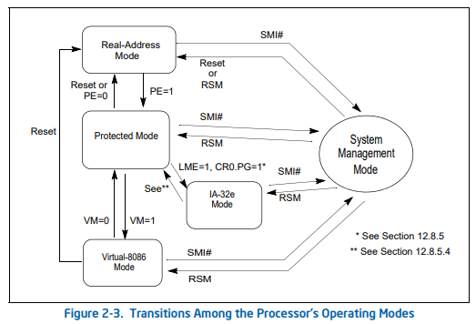

<Callout title="Disclaimer">This guide is meant for people with very little experience. This isn't telling you how exactly to make a bootloader, it is teaching you the concepts associated. If you follow along and have a curious mind, this will not just teach you how to make a bootloader, but extremely important concepts in osdev.</Callout>

<Callout title="Disclaimer">This guide is valid only for Intel architecture.</Callout>

# Part 1 - Basic concepts about CPU System Management Modes

CPUs have different operating modes, which can only be accessed progressively and according to certain criteria. Most modern *Intel CPUs* support a total of *four* modes, each with different features and characteristics.

The four modes are:
- **Real Mode**
- **Protected Mode**
- **Virtual 8086 Mode**
- **Long Mode**

Let's see in the details the four modes.

## The Real Mode
Real Mode is *the first mode* the CPU *boots into*.

It is a simple **16-bit** mode with *strong practical limitations*, but it is also the only mode from which you can *completely control every single CPU operation*.

### Limitations
The limitations are:
- Less than 1 MB of RAM available.
- There isn't any memory protection or virtual memory.
- There aren't security mechanisms to protect against crash or malwares.
- The default CPU operand length is only 16 bits.
- The memory addressing modes provided are more restrictive than other CPU modes.
- Accessing more than 64k requires the use of segment registers that are difficult to work with.

### Advantages
The advantages are:
- We can use BIOS drivers to control devices and handle interrupts.
- We can use an advanced collection of low level API functions provided by the BIOS.
- Memory access is really faster.

### Code example
```asm
[ORG 0x7C00]
[BITS 16]

mov si, msg

print:
    mov ah, 0x0e
    mov al, [si]
    cmp al, 0
    je done
    int 0x10
    inc si
    jmp print

done:
    jmp $

msg:
    db "Hello World!", 0

times 510-($-$$) db 0
db 0x55, 0xAA
```

#### Explanation
This example prints "Hello World!" in Real Mode.
Let's see every row what it do.

```asm
[ORG 0x7C00]    ; Offset at 0x7C00, where the program starts
[BITS 16]       ; Explain that the code is in Real Mode (isn't required to made it works)
```

```asm
mov si, msg     ; Copy in the si register the address of the phrase
```

```asm
print:              ; Function print
    mov ah, 0x0e    ; Say to the CPU that you want to print a value
    mov al, [si]    ; Load in al the value saved in the address stored in si
    cmp al, 0       ; Compare al's value to 0, if true it means that the phrase is ended
    je done         ; je - Jump if Equal, jump to done if al == 0
    int 0x10        ; If here, the phrase isn't ended. Call the interrupt and print the char
    inc si          ; Add 1 to the address saved in si (pass to next char)
    jmp print       ; Jump to print
```

```asm
done:       ; Function done
    jmp $   ; Jump forever here -> while(true) {}
```

```asm
msg:                        ; Save the first address of the phrase in msg
    db "Hello World!", 0    ; Save the text "Hello World!" with a 0 at the end.
```

```asm
times 510-($-$$) db 0   ; Add 0 until the whole file is 510 byte of size
db 0x55, 0xAA           ; Add the last 2 bytes of end program
```

## The Protected Mode
Protected Mode is the **main operating mode** of modern Intel processors.

This mode, also called **32-bit** mode, when enabled *permit to unleash the real power of the CPU*. However, *it will prevent really low-level calls* like BIOS interrupts.

### Limitations
The limitations are:
- Very complicated initial setup.
- No direct access to hardware from userspace.
- Complex virtual memory management.
- Debugging very difficult.
- Not compatible with Real Mode code.

### Advantages
The advantages are:
- Memory isolation and protection with segmentation and paging.
- Support for 3 Privilege Levels.
- Secure Multitasking Support.
- Kernel bug protection.

### Intel Manual Reference
To enter in Protected Mode, following the official Intel manual, you have to follow these steps:
- Disable interrupts
- Load the GDT
- Set the PE flag in the register cr0 (the Protected mode bit is set, so with value 1) (The cr0 is the Control Register 0)
- Execute a far jump *immediately after* the cr0 set
- If paging is enabled, the cr0 set and the far jump must be from a page that is identity mapped (that is, the linear address before the jump is the same as the physical address
after paging and protected mode is enabled)
- If a LDT is going to be used, load the LDT
- After the jump, in Protected Mode, reset the segment registers values (DS, SS, ES, FS and GS)
- If an IDT is going to be used, load the IDT
- If loaded an IDT enable maskable hardware interrupts and NMI interrupts (Non Maskable interrupts) (STI command)

The Manual also say that if other instructions exists between the cr0 set and the far jump, there may be random failures.

### Code example
```asm
[ORG 0x1000]
[BITS 16]

CODE_SEG equ codeDescriptor - GDTStart
DATA_SEG equ dataDescriptor - GDTStart

cli
lgdt [GDTDescriptor]

mov eax, cr0
or eax, 1
mov cr0, eax

jmp CODE_SEG:startProtectedMode
jmp $

align 8
GDTStart:
    nullDescriptor:
        dd 0
        dd 0

    codeDescriptor:
        dw 0xffff
        dw 0
        db 0

        db 0b10011010

        db 0b11001111

        db 0

    dataDescriptor:
        dw 0xffff
        dw 0
        db 0

        db 0b10010010

        db 0b11001111

        db 0
GDTEnd:

GDTDescriptor:
    dw GDTEnd - GDTStart - 1
    dd GDTStart

[BITS 32]
startProtectedMode:
    jmp $
```

#### Explanation
Okay, I know, it's scary, but don't let this get you down. This code took me months to write, but now I'll explain it to you in the simplest and most complete way possible.

This program enter in Protected Mode. Yes, it doesn't do anything else.

If you try to copy the entire code, compile it, and run it, it won't work because it's not designed to run in the first-stage bootloader. I ran it in the second stage of my bootloader, so I know it works perfectly. For more information on multi-stage bootloaders, I refer you to the dedicated guide.

Note that all parts of this code are **actually required** to **properly enter Protected Mode**. Certain values ​​can be changed, and there's obviously room for programming style, but *skipping steps described in this code risks crashing the system*.

Before to pass to the code explanation, I have to introduce you to the concept of *GDT* (Global Descriptor Table).

#### The Global Descriptor Table
The **Global Descriptor Table** (often called just **GDT**) is a data structure containing entries telling the CPU about memory segments.
In this example, as in most of the Operating Systems, the GDT has the null descriptor, the code descriptor and the data descriptor.

- The **null descriptor**, describe to the CPU the meaning of a *NULL value*.
- The **code descriptor**, describe to the CPU how to handle the code saved in the memory.
- The **data descriptor**, describe to the CPU how to handle the data saved in the memory.

Below is a simple but very detailed explanation of the program.

```asm
[ORG 0x1000]    ; Organise the program with an offset of 0x1000 (starts from 0x1000)
[BITS 16]       ; The code is in Real Mode
```

```asm
CODE_SEG equ codeDescriptor - GDTStart  ; CODE_SEG = relative address of the code descriptor in the GDT
DATA_SEG equ dataDescriptor - GDTStart  ; DATA_SEG = relative address of the data descriptor in the GDT
```

```asm
cli                     ; Clear Interrupt - Disable BIOS interrupt
lgdt [GDTDescriptor]    ; Load the GDT, saved at the GDTDescriptor address
```

```asm
mov eax, cr0    ; Save in eax (32-bit register) the value of cr0 (Control Register 0)
or eax, 1       ; Set the bit 0 to 1 (cr0 has 32 bits, the bit 0 is the "Protected Mode Enable" bit)
mov cr0, eax    ; Update the cr0 value with the eax updated value
```

The piece of code above is the main of the Protected Mode enable process: it enable the Protected Mode by setting the last bit of the cr0 register (the Control Register 0). To do this you need to use these three lines of code as you cannot directly access the value in cr0.

```asm
jmp CODE_SEG:startProtectedMode     ; Jump to the 32-bit code part using the GDT code info
jmp $                               ; Fallback if something get wrong
```

```asm
align 8                 ; Align the GDT to 8-bit blocks (REQUIRED!)
GDTStart:               ; The address of the start of the GDT
    nullDescriptor:     ; The null descriptor
        dd 0            ; Allocate 32 bits of 0
        dd 0            ; Allocate 32 bits of 0

    codeDescriptor:     ; The code descriptor
        dw 0xffff       ; Allocate 16 bits with value 0xFFFF (all bits to 1)
        dw 0            ; Allocate 16 bits of 0
        db 0            ; Allocate 8 bits of 0

        db 0b10011010   ; Allocate 8 bits with value 10011010

        db 0b11001111   ; Allocate 8 bits with value 11001111

        db 0            ; Allocate 8 bits of 0

    dataDescriptor:     ; The data descriptor
        dw 0xffff
        dw 0            ; Allocate 16 bits of 0
        db 0            ; Allocate 8 bits of 0

        db 0b10010010   ; Allocate 8 bits with value 10010010

        db 0b11001111   ; Allocate 8 bits with value 11001111

        db 0            ; Allocate 8 bits of 0
GDTEnd:                 ; The address of the end of the GDT
```

Let's see more in details the meaning of the GDT:

```asm
db 0b10011010
```
This is really important for the code descriptor. Here the meaning of each bit.
We have 2 type of bitsets, both of 4 bits:
- *Info flags*
- *Type flags*

**Info flags**
*Present, Privilege, Type* (1001)
*Present* = 1 - Means that it's a used segment, don't set to 0. Never set it to 0. Really, your OS may explode.
*Privilege* = 00 | 01 | 10 | 11 (00 is the hightest) - Means max privileges
*Type* = 1 (1 for code or data, 0 for system segments) - Means that it's the code or data descriptor

**Type flags**
*Code, Conforming, Readable, Accessed* (1010)
*Code* = 1 (1 for code, 0 for data) - Means that it's the code descriptor
*Conforming* = 0 (1 is conforming, 0 is non-conforming) - Means that's non-conforming
*Readable* = 1 (1 for readable and executable, 0 for only executable) - Means that it's readable
*Accessed* = 0 (used by CPU -> if CPU has been accessed is 1, else is 0) - Always set to 0

```asm
db 0b11001111
```
This is additional informations flags.
Also here, we have 2 type of bitsets, both of 4 bits:
- *Segment informations*
- *Limit*

**Segment informations**
*Granularity, Default operand size, 64-bit segment, Available* (1100)
*Granularity* = 1 (1 for the limit in pages of 0x1000 bytes, 0 for limit in bytes) - We have an highter code limit
*Default operand size* = 1 (0 for 16-bit segments, 1 for 32-bit segments) - You need to set it to 1 to enable the Protected Mode
*64-bit segment* = 0 (0 for normal, 1 for 64-bit) - You must set it to 0 now
*Available* = 0 (Usable by the OS) - This is a bit that OS can use for their stuffs, but nobody uses it, so is set to 0

**Limit**
*Limit* (1111)
*Limit* = 1111 - Yes, all to 1 to haven't size problems later

```asm
db 0b10010010
```
Now we are talking about the data descriptor. It's similar for most of the things.

We have 2 type of bitsets, both of 4 bits:
- *Info flags*
- *Type flags*

**Info flags**
*Present, Privilege, Type* (1001)
*Present* = 1 - Means that it's a used segment, don't set to 0. Never set it to 0. Really, your OS may explode.
*Privilege* = 00 | 01 | 10 | 11 (00 is the hightest) - Means max privileges
*Type* = 1 (1 for code or data, 0 for system segments) - Means that it's the code or data descriptor

**Type flags**
*Code, Expand-down, Writable, Accessed* (0010)
*Code* = 0 (1 for code, 0 for data) - Means that it's the data descriptor
*Expand-down* = 0 (1 for expand-down, 0 for normal) - Means that's normal (the expand-down is for stacks that needs to expand during execution - really advanced stuffs, set to 0 and don't worry)
*Writable* = 1 (1 for writable and readable, 0 for only readable) - Means that it's writable
*Accessed* = 0 (used by CPU -> if CPU has been accessed is 1, else is 0) - Always set to 0

```asm
db 0b11001111
```
This is additional informations flags.
Also here, we have 2 type of bitsets, both of 4 bits:
- *Segment informations*
- *Limit*

**Segment informations**
*Granularity, Default operand size, 64-bit segment, Available* (1100)
*Granularity* = 1 (1 for the limit in pages of 0x1000 bytes, 0 for limit in bytes) - We have an highter code limit
*Default operand size* = 1 (0 for 16-bit segments, 1 for 32-bit segments) - You need to set it to 1 to enable the Protected Mode
*64-bit segment* = 0 (0 for normal, 1 for 64-bit) - You must set it to 0 now
*Available* = 0 (Usable by the OS) - This is a bit that OS can use for their stuffs, but nobody uses it, so is set to 0

**Limit**
*Limit* (1111)
*Limit* = 1111 - Yes, all to 1 to haven't size problems later

```asm
GDTDescriptor:
    dw GDTEnd - GDTStart - 1    ; The size of the GDT in 16 bits
    dd GDTStart                 ; The 32 bits address of the start of the GDT
```

```asm
[BITS 32]               ; Finally we are in 32-bits mode (Protected Mode)
startProtectedMode:     ; The address where we have to arrive with the far jump
    jmp $               ; Stop the program
```
This part **must be at the end of the file**, because is the only part in Protected Mode.

